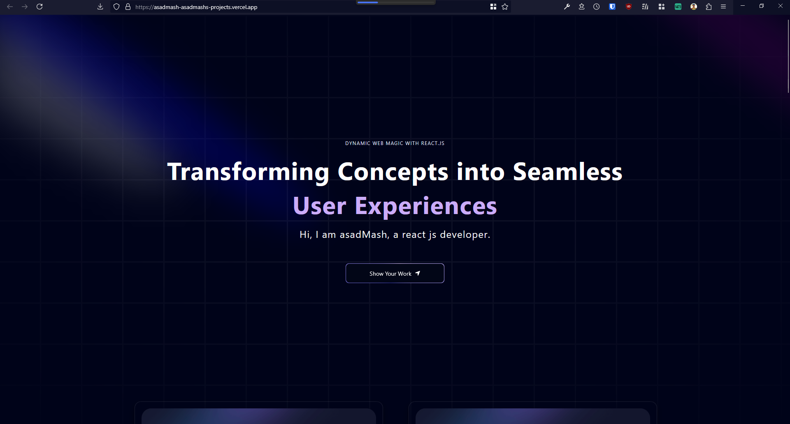

# 🚀 My Portfolio Website

Welcome to the repository for my personal portfolio website! Built with cutting-edge web technologies, this website showcases my skills, projects, and expertise as a front-end web developer.

## 🔗 Live Demo
Check out my live portfolio here: [**Live Website**](https://asadmash-asadmashs-projects.vercel.app/)

## 🛠 Tech Stack
This project is powered by modern front-end technologies:

- **Next.js** – For server-side rendering and better SEO
- **React.js** – Component-based UI development
- **Tailwind CSS** – Utility-first styling for a sleek and responsive design
- **Framer Motion** – For smooth and elegant animations
- **GSAP** – Advanced animations and interactions
- **Vercel** – Deployment and hosting

## 🎨 Features
- **Fully Responsive** – Works seamlessly on all devices
- **Smooth Animations** – Engaging user interactions powered by Framer Motion & GSAP
- **SEO Optimized** – Fast load times and improved search visibility
- **Dark Mode Support** – Toggle between light and dark themes
- **Projects Showcase** – Displays my best work with interactive previews
- **Contact Form** – Users can reach out easily

## 📸 Screenshots

---

⭐ **If you like this project, don't forget to give it a star!** ⭐

